# AIPAS

AIPAS is IP Adddress Management Solution built in Azure to let (Network) Administrators keep up-to-date records of IP assignments and available addresses used to configure Azure Virtual Networks (VNets). 

It was developed to be used to support the deployment of Enterprise Scale [Landing Zones](https://stefanstranger.github.io/2020/10/16/EnterpriseScaleSubscriptionDemocratization/#what-is-a-landing-zone) and their accompanied Virtual Networks.

- [AIPAS](#aipas)
  - [Architectural Overview](#architectural-overview)
  - [AIPAS REST API reference](#aipas-rest-api-reference)
    - [Add Address Space](#add-address-space)
      - [Examples](#examples)
    - [Register Address Space](#register-address-space)
      - [Examples](#examples-1)
    - [Update Address Space](#update-address-space)
  - [Requirements](#requirements)
  - [Local development](#local-development)
    - [Install local development prerequisites](#install-local-development-prerequisites)
    - [Clone AIPAS Repository](#clone-aipas-repository)
    - [Install PowerShell Modules](#install-powershell-modules)
    - [Deploy Azure Storage Table](#deploy-azure-storage-table)
    - [Create Service Principal](#create-service-principal)
    - [Run Azure Function locally](#run-azure-function-locally)
  - [Github Deployment](#github-deployment)
    - [Pre-requisites](#pre-requisites)
    - [Service Principal for Azure Function](#service-principal-for-azure-function)
    - [Configure deployment credentials](#configure-deployment-credentials)
    - [Deploy Storage Account](#deploy-storage-account)
    - [Application Settings for Azure Function](#application-settings-for-azure-function)
    - [Storage Account Contributor permissions](#storage-account-contributor-permissions)
    - [Deploy Azure Function](#deploy-azure-function)
    - [Test Functions](#test-functions)
  - [Virtual Network deployment](#virtual-network-deployment)
  - [TODO](#todo)
  - [Need Help?](#need-help)
  - [References](#references)

## Architectural Overview


## AIPAS REST API reference

### Add Address Space

| AddAddressSpace |
|----------|
| HTTPS |
| POST https://aipas.azurewebsites.net/api/AddAddressSpace?code=[code] |

#### Examples

Sample Request

| AddAddressSpace |
|----------|
| HTTPS |
| POST https://aipas.azurewebsites.net/api/AddAddressSpace?code=[code] |

Request Body

<table>
  <td width="601" valign="top" style="width: 450.8pt; padding: 5px;">
  <p class="MsoNormal" style="margin-bottom:0in;line-height:normal"><span lang="EN-US">{<br></span><span style="font-size: 0.875rem;">&nbsp; &nbsp;&nbsp;</span><span style="font-size: 0.875rem;">"NetworkAddress": [<br></span><span style="font-size: 0.875rem;">&nbsp; &nbsp;&nbsp;</span><span style="font-size: 0.875rem;">"10.0.0.0/16",<br></span><span style="font-size: 0.875rem;">&nbsp; &nbsp;&nbsp;</span><span style="font-size: 0.875rem;">"10.1.0.0/16",<br></span><span style="font-size: 0.875rem;">&nbsp; &nbsp;&nbsp;</span><span style="font-size: 0.875rem;">"10.2.0.0/24"<br></span><span style="font-size: 0.875rem;">&nbsp; &nbsp;</span><span style="font-size: 0.875rem;">]<br></span><span style="font-size: 0.875rem;">}</span></p>
  </td>
</table>

Sample Response

Status code: 200

<table>
<td>
<p>[<br />&nbsp; {<br />&nbsp;&nbsp;&nbsp; "odata.metadata": "https://jpupa3c3pvbnqstorage.table.core.windows.net/$metadata#ipam/@Element",<br />&nbsp;&nbsp;&nbsp; "odata.etag": "W/\"datetime'2021-02-13T17%3A20%3A18.4783595Z'\"",<br />&nbsp;&nbsp;&nbsp; "PartitionKey": "ipam",<br />&nbsp;&nbsp;&nbsp; "RowKey": "d9c8e7e6-9840-42b8-b542-69340ba91e0f",<br />&nbsp;&nbsp;&nbsp; "Timestamp": "2021-02-13T17:20:18.4783595Z",<br />&nbsp;&nbsp;&nbsp; "CreatedDateTime": "2021-02-13T18:20:17.2578711+01:00",<br />&nbsp;&nbsp;&nbsp; "Allocated": "False",<br />&nbsp;&nbsp;&nbsp; "NetworkAddress": "10.0.0.0/16",<br />&nbsp;&nbsp;&nbsp; "FirstAddress": "10.0.0.4",<br />&nbsp;&nbsp;&nbsp; "LastAddress": "10.0.255.254",<br />&nbsp;&nbsp;&nbsp; "Hosts": 65531.0,<br />&nbsp;&nbsp;&nbsp; "LastModifiedDateTime": "2021-02-13T18:20:17.2579707+01:00"<br />&nbsp; },<br />&nbsp; {<br />&nbsp;&nbsp;&nbsp; "odata.metadata": "https://jpupa3c3pvbnqstorage.table.core.windows.net/$metadata#ipam/@Element",<br />&nbsp; &nbsp; "odata.etag": "W/\"datetime'2021-02-13T17%3A20%3A18.6027618Z'\"",<br />&nbsp; &nbsp; "PartitionKey": "ipam",<br />&nbsp;&nbsp;&nbsp; "RowKey": "5ba73975-7755-49cd-aa19-5c80395a38eb",<br />&nbsp;&nbsp;&nbsp; "Timestamp": "2021-02-13T17:20:18.6027618Z",<br />&nbsp;&nbsp;&nbsp; "CreatedDateTime": "2021-02-13T18:20:17.3911336+01:00",<br />&nbsp;&nbsp;&nbsp; "Allocated": "False",<br />&nbsp;&nbsp;&nbsp; "NetworkAddress": "10.1.0.0/16",<br />&nbsp;&nbsp;&nbsp; "FirstAddress": "10.1.0.4",<br />&nbsp;&nbsp;&nbsp; "LastAddress": "10.1.255.254",<br />&nbsp;&nbsp;&nbsp; "Hosts": 65531.0,<br />&nbsp;&nbsp;&nbsp; "LastModifiedDateTime": "2021-02-13T18:20:17.3912494+01:00"<br />&nbsp; },<br />&nbsp; {<br />&nbsp;&nbsp;&nbsp; "odata.metadata": "https://jpupa3c3pvbnqstorage.table.core.windows.net/$metadata#ipam/@Element",<br />&nbsp;&nbsp;&nbsp; "odata.etag": "W/\"datetime'2021-02-13T17%3A20%3A18.7357861Z'\"",<br />&nbsp;&nbsp;&nbsp; "PartitionKey": "ipam",<br />&nbsp;&nbsp;&nbsp; "RowKey": "7365fbe3-adf7-4a1a-a1b7-678302140b15",<br />&nbsp;&nbsp;&nbsp; "Timestamp": "2021-02-13T17:20:18.7357861Z",<br />&nbsp;&nbsp;&nbsp; "CreatedDateTime": "2021-02-13T18:20:17.5215624+01:00",<br />&nbsp;&nbsp;&nbsp; "Allocated": "False",<br />&nbsp;&nbsp;&nbsp; "NetworkAddress": "10.2.0.0/24",<br />&nbsp;&nbsp;&nbsp; "FirstAddress": "10.2.0.4",<br />&nbsp;&nbsp;&nbsp; "LastAddress": "10.2.0.254",<br />&nbsp;&nbsp;&nbsp; "Hosts": 251.0,<br />&nbsp;&nbsp;&nbsp; "LastModifiedDateTime": "2021-02-13T18:20:17.5217189+01:00"<br />&nbsp; }<br />]</p>
</td>
</table>

Status code: 400
<table>
<td>
Address Space 10.0.0.0/16 already added
</td>
</table>

### Register Address Space

| RegisterAddressSpace |
|----------|
| HTTPS |
| POST https://aipas.azurewebsites.net/api/RegisterAddressSpace?code=[code] |

#### Examples

Sample Request

| RegisterAddressSpace |
|----------|
| HTTPS |
| POST https://aipas.azurewebsites.net/api/RegisterAddressSpace?code=[code] |

Request Body

<table>
  <td>
  <p>{<br />&nbsp;&nbsp; "InputObject": {<br />&nbsp;&nbsp;&nbsp;&nbsp;&nbsp;&nbsp; "ResourceGroup": "myclaims-rg",<br />&nbsp;&nbsp;&nbsp;&nbsp;&nbsp;&nbsp; "VirtualNetworkName": "MyClaims-vnet"<br />&nbsp; }<br />}</p>
  </td>
</table>

Sample Response

Status code: 200

<table>
<td><p>{&nbsp;<br />&nbsp; "odata.type": "jpupa3c3pvbnqstorage.ipam",&nbsp;<br />&nbsp; "odata.id": "https:// jpupa3c3pvbnqstorage.table.core.windows.net/ipam(PartitionKey='ipam',RowKey='4fb91aa3-ec73-49cc-a644-9d02ab7a82cf')",&nbsp;<br />&nbsp; "odata.etag": "W/\"datetime'2021-01-24T14%3A53%3A14.4436468Z'\"",&nbsp;<br />&nbsp; "odata.editLink": "ipam(PartitionKey='ipam',RowKey='4fb91aa3-ec73-49cc-a644-9d02ab7a82cf')",&nbsp;<br />&nbsp; "PartitionKey": "ipam",&nbsp;<br />&nbsp; "RowKey": "4fb91aa3-ec73-49cc-a644-9d02ab7a82cf",&nbsp;<br />&nbsp; "Timestamp@odata.type": "Edm.DateTime",&nbsp;<br />&nbsp; "Timestamp": "2021-01-24T14:53:14.4436468Z",&nbsp;<br />&nbsp; "Allocated": "False",&nbsp;<br />&nbsp; "CreatedDateTime": "2021-01-15T13:56:07.5253887+01:00",&nbsp;<br />&nbsp; "FirstAddress": "10.2.0.4",&nbsp;<br />&nbsp; "Hosts": 251.0,&nbsp;<br />&nbsp; "LastAddress": "10.2.0.254",&nbsp;<br />&nbsp; "LastModifiedDateTime": "2021-01-24T15:44:14.8422325+01:00",&nbsp;<br />&nbsp; "NetworkAddress": "10.2.0.0/24"&nbsp;<br />}&nbsp;</p>
</td>
</table>

Status code: 400
<table>
<td>
Failed to register free address space
</td>
</table>

### Update Address Space

The UpdateAddressSpace Azure Function is a timer function which is scheduled to run every day at 9:30 AM. If you want to change the schedule please change the [function.json](https://github.com/stefanstranger/AIPAS/blob/master/src/function/UpdateAddressSpaceTimer/function.json) schedule configuration.

## Requirements

Azure Subscription with:

- Resource Group
- Azure Storage Account and Storage Table
- Azure Function

## Local development

If you want to further develop or test AIPAS you need to install the following prerequisites on your Windows development machine.

### Install local development prerequisites

- Git client
- Visual Studio Code
- Azure Function Core Tools (version 3.0.3160 or higher)
- PowerShell (Core)
- HTTP Testing and Debugging tool like [Httpmaster](https://www.httpmaster.net/) of [Insomnia](https://insomnia.rest/)

If you installed [Chocolatey](https://chocolatey.org/) (a Windows Apt-Get kinda tool) you can install above software with the following commands:

```PowerShell
# Install Git
choco install git
# Install VSCode
choco install vscode
# Install Azure Function Core Tools
choco install azure-functions-core-tools-3
# Install PowerShell Core
choco install pwsh
# Install HttpMaster
choco install httpmaster-express
```

### Clone AIPAS Repository

```PowerShell
git clone https://github.com/stefanstranger/AIPAS.git
```

### Install PowerShell Modules

After cloning the Git Repository you can use the bootstrap.ps1 script to install the required PowerShell modules.

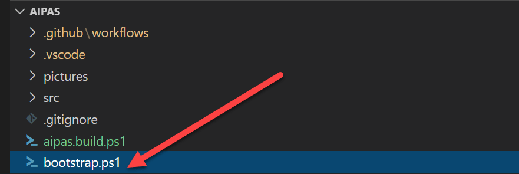

The following PowerShell Modules need to be installed:

- InvokeBuild
- Pester
- PlatyPS
- Az PowerShell modules*

\* The installation of the Az PowerShell modules are not part of the bootstrap.ps1 script. If you have not installed these PowerShell modules run Install-Module -Name Az on your development machine.


### Deploy Azure Storage Table

Within the Git Repository there are Azure Resource Manager Template files that can be used to deploy a new Resource Group with an Azure Storage Table.

Run the following PowerShell Azure commands:

```PowerShell
<#
    Run from within your cloned repo folder
#>

#region Login to Azure
Add-AzAccount
#endregion
 
#region Select Azure Subscription
$subscription = 
(Get-AzSubscription |
    Out-GridView `
        -Title 'Select an Azure Subscription ...' `
        -PassThru)
 
Set-AzContext -SubscriptionId $subscription.subscriptionId -TenantId $subscription.TenantID
#endregion

#region Create a new Resource Group
New-AzResourceGroup -Name 'AIPAS-rg' -Location 'westeurope'
#endregion

#region Deploy Azure Storage Table in Resource Group
$params = @{
    'ResourceGroupName' = 'AIPAS-rg'
    'Mode' = 'Incremental'
    'Name' = 'AIPAS_IPAM_Deployment'
    'TemplateFile' = '.\src\templates\azuredeploy.json'
    'TemplateParameterFile' = '.\src\templates\azuredeploy.parameters.json'
}

New-AzResourceGroupDeployment @params
#endregion
```

The following Resource Group and Storage Account (yours should differ) should be installed.

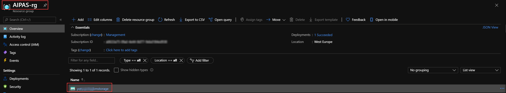

### Create Service Principal

The new Azure Function needs to run under an Service Principal Identity with the following RBAC:

- Storage Account Contributor on the previously deployed Storage Account
- Reader on all Subscriptions where Virtual Network will be deployed.

Use the following command to create the Service Principal and store Service Principal ClientId, ClientSecret, SubscriptionId and TenantId as local environment variables to be used during local development of the Azure Function.

```PowerShell
<#
    PowerShell script to create a Service Principal for the Poorman's IPAM Azure Function
#>

#region variables
$ResourceGroupName = "AIPAS-rg" #used to scope the permissions for the SPN. This is where the Storage Account is being deployed.
$RoleDefinitionName = "Storage Account Contributor"
$ADApplicationName = "AIPAS"
$PlainPassword = "[enter password for SPN]"
$StorageAccountName = "[Configure here the name of the previously deployed Storage Account]"
$SubscriptionId = "[enter subscriptionid]"" #SubscriptionId where the Vnets will be deployed. E.g. the Landing Zone Subscription. If multiple Subscriptions are used rerun for each Subscription

#region Login to Azure
Add-AzAccount
#endregion
 
#region Select Azure Subscription
$subscription = 
(Get-AzSubscription |
    Out-GridView `
        -Title 'Select an Azure Subscription ...' `
        -PassThru)
 
Set-AzContext -SubscriptionId $subscription.subscriptionId -TenantId $subscription.TenantID
#endregion

#region create SPN with Password
$Password = ConvertTo-SecureString $PlainPassword  -AsPlainText -Force
New-AzADApplication -DisplayName $ADApplicationName -HomePage "https://www.testAIPAS.test" -IdentifierUris "https://www.testAIPAS.test" -Password $Password -OutVariable app
$Scope = Get-AzResourceGroup -Name $ResourceGroupName
New-AzADServicePrincipal -ApplicationId $($app.ApplicationId) -Role $RoleDefinitionName -Scope $($Scope.ResourceId)
# Add read permissions on all Subscriptions!!! For retrieving VNet information using the Resource Graph...
New-AzRoleAssignment -RoleDefinitionName Reader -ServicePrincipalName $($app.ApplicationId.Guid) -Scope ('/subscriptions/{0}' -f $SubscriptionId)

Get-AzADApplication -DisplayNameStartWith $ADApplicationName -OutVariable app
Get-AzADServicePrincipal -ServicePrincipalName $($app.ApplicationId.Guid) -OutVariable SPN
#endregion

#region output info. Store below output in secret vault you might need them in the future.
[ordered]@{
    "clientId"       = "$($app.ApplicationId)"
    "clientSecret"   = "$PlainPassword"
    "subscriptionId" = "$($subscription.subscriptionId)"
    "tenantId"       = "$($subscription.TenantID)"
} | Convertto-json
#endregion

#region create local environment variables
[Environment]::SetEnvironmentVariable("AIPASClientId", "$($app.ApplicationId)", "User")
[Environment]::SetEnvironmentVariable("AIPASClientSecret", "$PlainPassword", "User")
[Environment]::SetEnvironmentVariable("AIPASSubscriptionId", "$($subscription.subscriptionId)", "User")
[Environment]::SetEnvironmentVariable("AIPAStenantId", "$($subscription.TenantID)", "User")
[Environment]::SetEnvironmentVariable("AIPASResourceGroupName", $ResourceGroupName, "User")
[Environment]::SetEnvironmentVariable("AIPASStorageAccountName", $StorageAccountName, "User")
# Restart VSCode to have access to the environment variables
#endregion
```

Make sure you store the following outputs in a secure vault. You need them later.

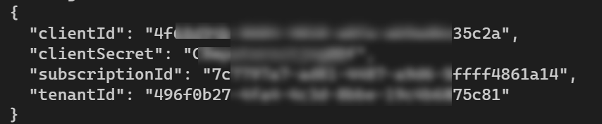

During local development these values need to be stored as environment variables.

### Run Azure Function locally

You should now have installed a Resource Group containing a Storage Account and and Service Principal with Storage Account Contributor on the Storage Account and reader permission on the Subscription where the Virtual Network(s) will be deployed e.g. Landing Zone Subscription(s).

The Github Repository contains [Visual Studio Code Tasks](https://github.com/stefanstranger/AIPAS/blob/main/.vscode/tasks.json) that can help during the development. 

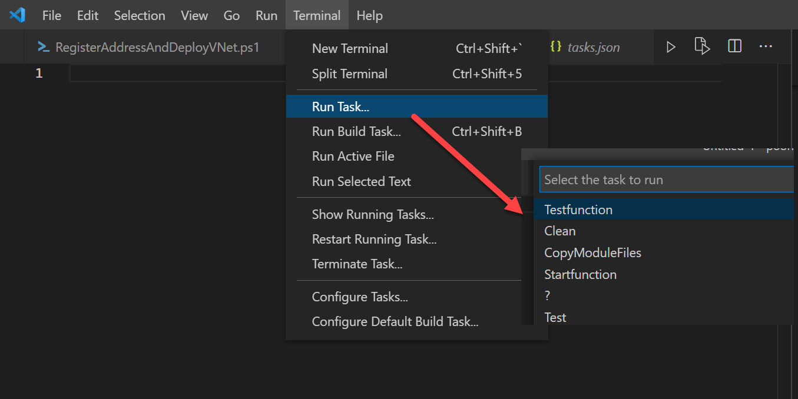

The task *Testfunction* cleans up the Azure Function folder, copies the PowerShell Modules and starts all the Azure Functions.

You should see the following Azure Functions being started.

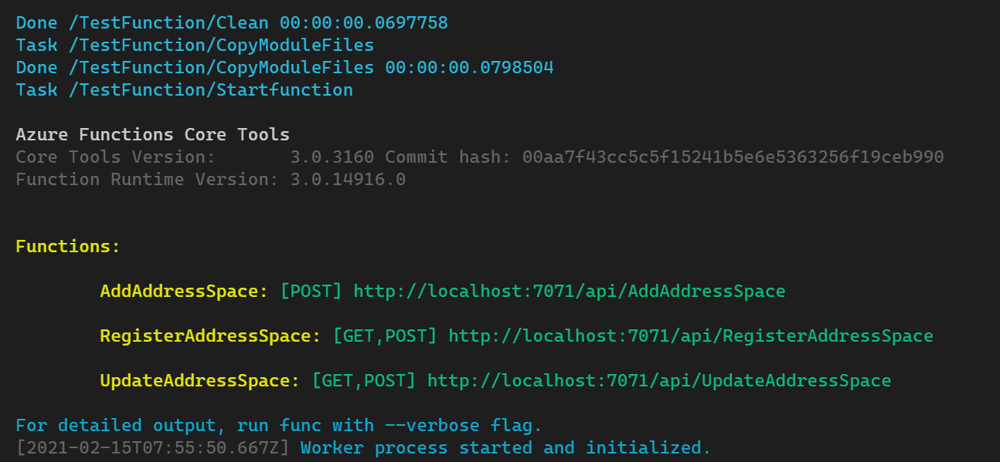

You can now use a tool like [HttpMaster](https://www.httpmaster.net) to locally test the AIPAS IPAM Solution.

You first need to add some address spaces to the Storage Account Table calling the **AddAddressSpace** REST API endpoint with the required body.

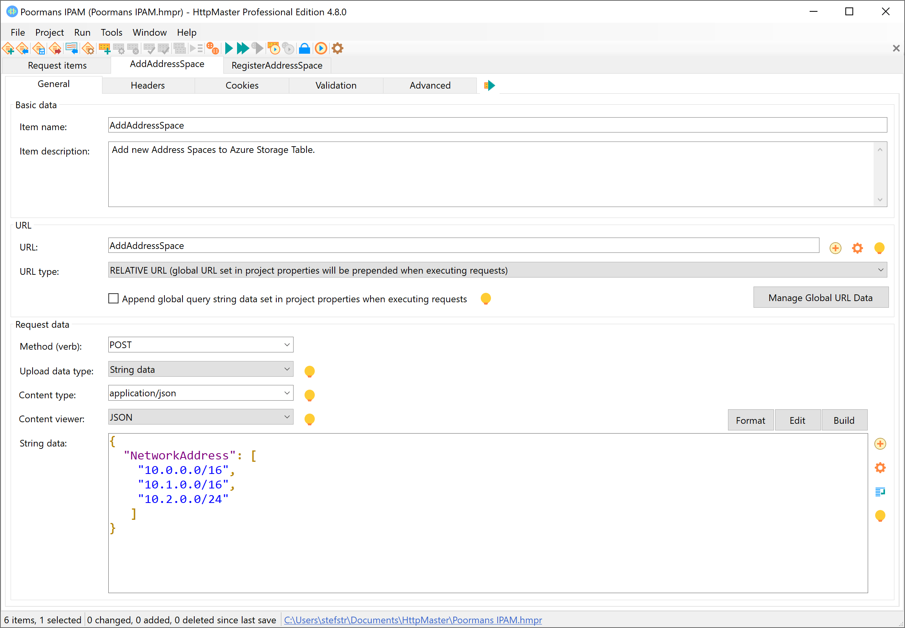

The Storage Account Table should now contain the following entities.

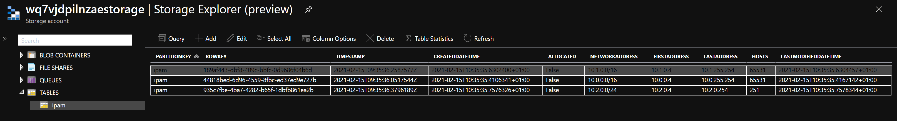

Next step is calling the **RegisterAddressSpace** REST API endpoint.

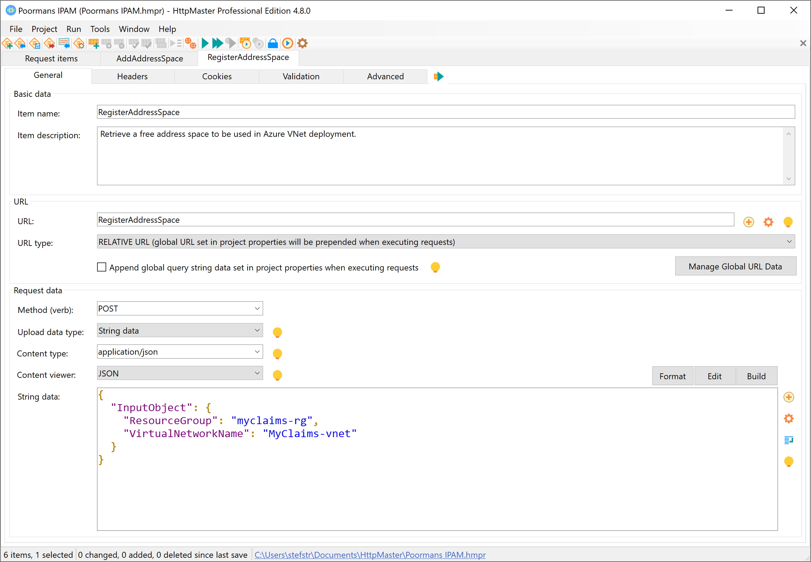

The Storage Account Table should now contain the following entities.

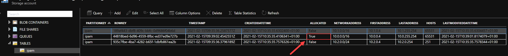

As a final test you can call the UpdateAddressSpace (test) REST API. This REST API is only for (local) testing. There is an Azure Function called UpdateAddressSpaceTimer which is a timer scheduled Azure Function.

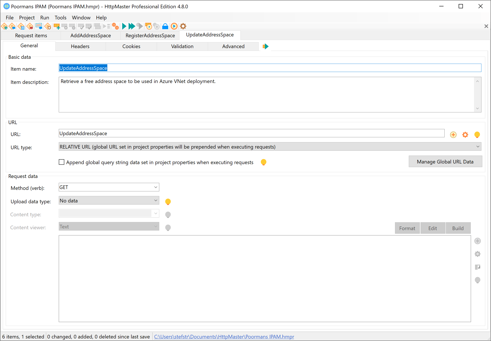

After a successful call to this (test) Function the Storage Table Entities should like this.

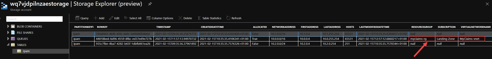

**REMARK:**

You first need to have deployed a Resource Group called 'myclaim-rg' with a VNet called 'MyClaims-Vnet' and the assigned address range '10.0.0.0/16' in Subscription 'Landing Zone'


## Github Deployment

Within the Github repository there are Github Workflow which can be used for the deployment of the Azure Storage Account and Azure Function in Azure.

### Pre-requisites

- [Service Principal for Azure Function](#create-service-principal)
- Service Principal to deploy the Azure Resources
- Application Settings for Azure Function

### Service Principal for Azure Function

This is the same Service Principal as used during the local development. 

### Configure deployment credentials

The Github Workflow requires credentials to deploy the Resource Group, Storage Account and the Azure Function.

1. Create SPN and Grant Permission

>Note: The Service Principal requires "Contributor" permission at the Subscription e.g. 'Management' root scope (/) in order to complete all the requisite steps (creation of Resource Group, Storage Account and Azure Function), and the permission will be inherited to all child scopes in Azure.

```bash
az ad sp create-for-rbac --name "{sp-name}" --sdk-auth --role contributor \
    --scopes /subscriptions/{subscription-id}
```
Replace the following:

- {sp-name} with a suitable name for your service principal, such as the name of the app itself. The name must be unique within your organization.

- {subscription-id} with the subscription ID you want to use (found in Subscriptions in portal)

When complete, the `az ad sp create-for-rbac` command displays JSON output in the following form (which is specified by the `--sdk-auth` argument):

    ```json
    {
      "clientId": "<GUID>",
      "clientSecret": "<GUID>",
      "subscriptionId": "<GUID>",
      "tenantId": "<GUID>",
      (...)
    }
    ```
2. In your repository, use **Add secret** to create a new secret named `AZURE_CREDENTIALS` (as shown in the example workflow), or using whatever name is in your workflow file.

Paste the entire JSON object produced by the `az ad sp create-for-rbac` command as the secret value and save the secret.

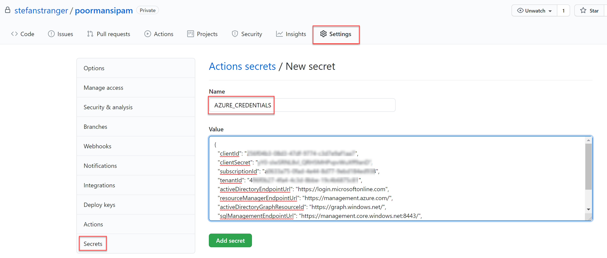

### Deploy Storage Account

After configuring the AZURE_CREDENTIALS it's time to deploy the Storage Account. You can use the Github Workflow called [Deploy-Storage-Account](https://github.com/stefanstranger/AIPAS/blob/master/.github/workflows/deploy-storageaccount.yaml).

You need to update the following values in the deploy-storage-account yaml file.

```json
env:
      RESOURCEGROUPNAME: "[Enter a Resource Group Name]"    # Set this variable for the Resource Group Name where to store the Storage Account
      SUBSCRIPTIONID: "[Enter your subscriptionid]"  # Set this variable to deploy the above Resource Group in a certain Subscription
      REGION: "westeurope" # Set this variable to have the Resource Group and Storage Account deployed in a certain location
```

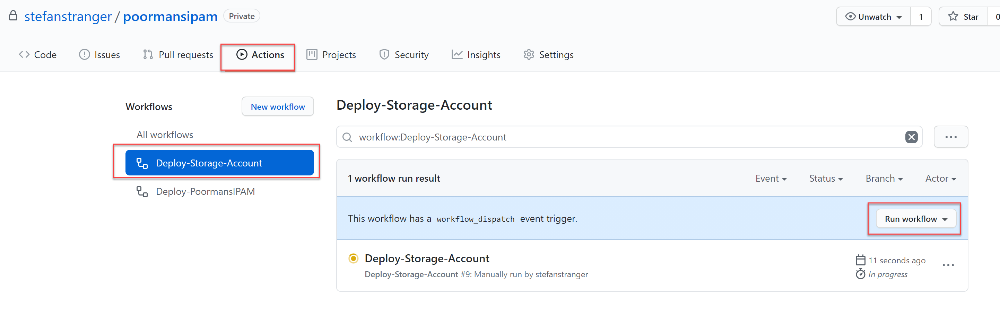

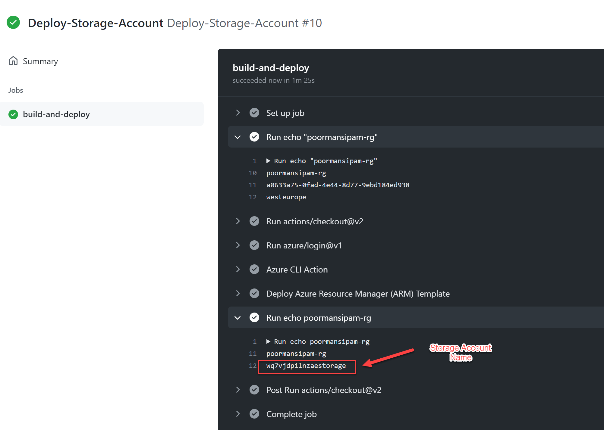

When the Resource Group and Storage Account succesfully are deployed use the following output for the configuration of the APP_SETTINGS Github secret.

### Application Settings for Azure Function

The Azure Function's Application Settings are stored a Github Secret called "APP_SETTINGS".

Create a JSON file with the following information and store the output of last region "Use in APP Settings Github Secret" in your Github Repository as secret variable called "APP_SETTINGS"

```json
[
  {
    "name": "AIPASClientId",
    "value": "[CLientID of SPN used during local development]"
  },
  {
    "name": "AIPASClientSecret",
    "value": "[ClientSecret (password) of SPN used during local development]"
  },
  {
    "name": "AIPASTenantId",
    "value": "[TenantId of SPN used during local development]"
  },
  {
    "name": "AIPASSubscriptionId",
    "value": "SubscriptionId of SPN used during local development]"
  },
  {
    "name": "AIPASStorageAccountName",
    "value": "[Storage Account Name from output of Storage Acount deployment]"
  },
  {
    "name": "AIPASResourceGroupName",
    "value": "[Resource Group Name from output of Storage Acount deployment]"
  }
]
```

Example APP_SETTINGS input

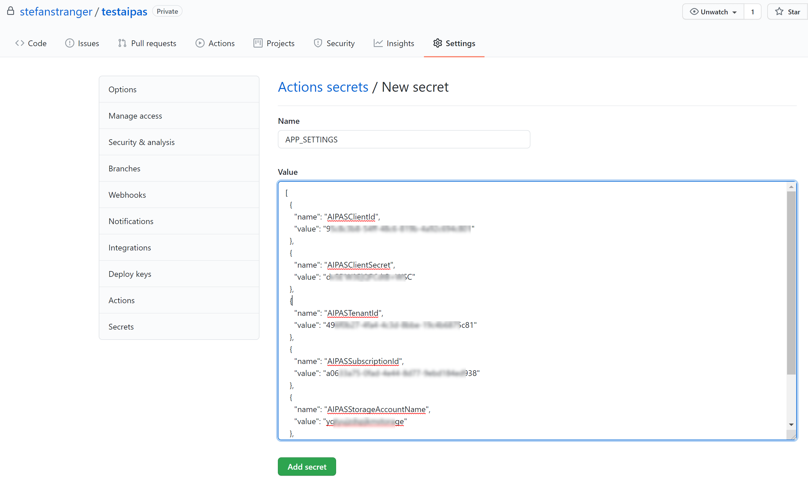

You can find more information about configuring Application Settings Secrets <a href="https://github.com/Azure/appservice-settings" target="_blank">here</a>.

### Storage Account Contributor permissions

If you have not configured yet the Storage Account Contributor permissions on the deployed Storage Account (which you might have already done for local development) you need to configure this now for the Service Principal used by the Azure Function.

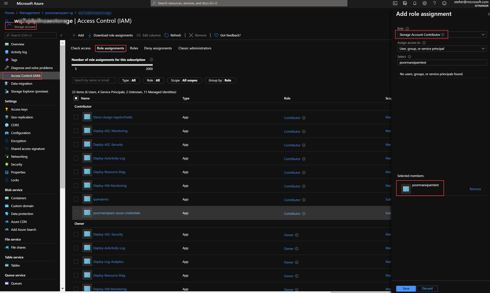

### Deploy Azure Function

The last step is the deployment of the Azure Function which also can be done using the a Github Workflow called ["Deploy-Azure-Function"](https://github.com/stefanstranger/AIPAS/blob/main/.github/workflows/deploy-azure-function.yaml).

Update the Github Action Workflow environment variables for your environment and start the Github Action Workflow.

You need to update the following values in the deploy-azure-function yaml file.

```json
env:
  AZURE_FUNCTIONAPP_NAME: "[enter the name for your Function App]"    # set this to your application's name
  AZURE_FUNCTenv:
  AZURE_FUNCTIONAPP_NAME: "[enter the name for your Function App]"    # set this to your application's name
  AZURE_FUNCTIONAPP_PACKAGE_PATH: "./src/function/"  # set this to the path to your web app project, defaults to the repository root
  RESOURCEGROUPNAME: "[Enter a Resource Group Name]"    # Set this variable for the Resource Group Name where to deploy the Azure Function. This needs to be the same RG as where the Storage Account was being deployed.
  SUBSCRIPTIONID: "[Enter a Subscription ID]"  # Set this variable to deploy the above Resource Group in a certain Subscription
  STORAGEACCOUNTNAME: "[Enter the name of Storage Account from the deploy-storage-account Github Action Workflow output]"
  REGION: "westeurope" # Set this variable to have the Resource Group and Storage Account deployed in a certain location
```

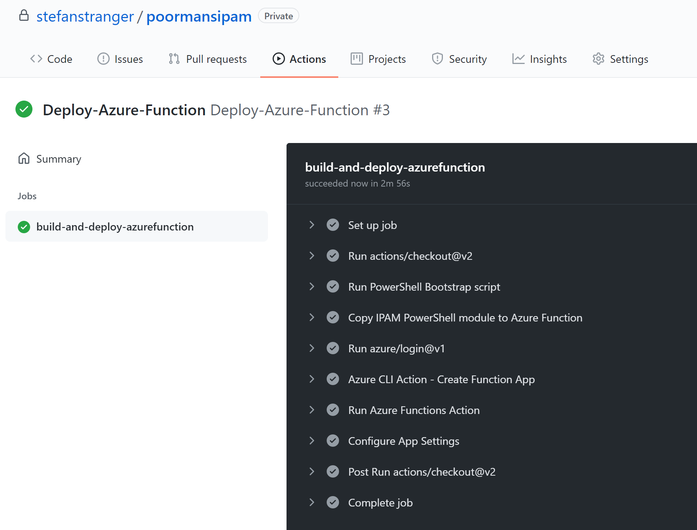

The following resources should have been deployed.

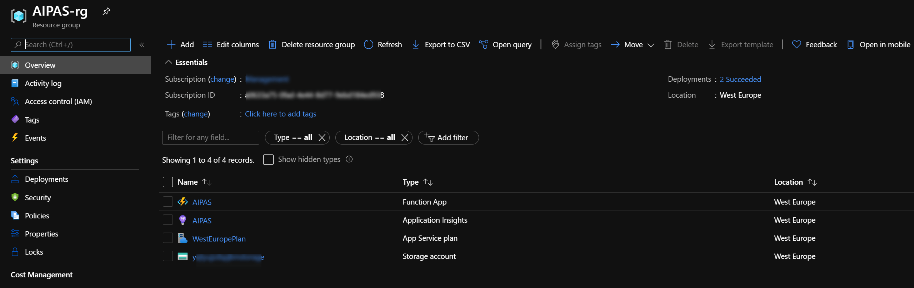

### Test Functions

You can use the Azure Portal for testing your Azure Functions. If everything is correctly configured and deployed you can now use your AIPAS solution.

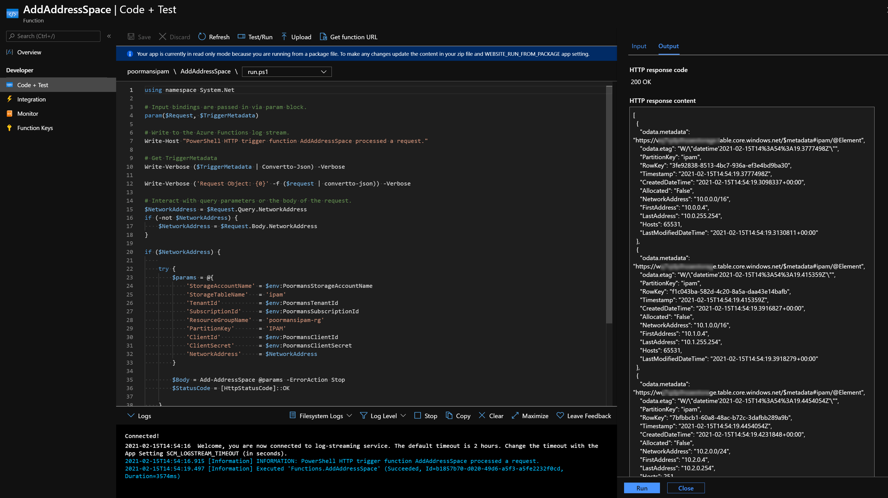

## Virtual Network deployment

The Azure Function RegisterAddressSpace can now be used when deploying a new Virtual Network as part of a Landing Zone deployment.

Suppose you want to deploy the following Virtual Network as part of the new Landing Zone Subscription and Resource Group:

| Azure Resource | Value |
|----------|----------|
| Subscription name | Landing Zone |
| ResourceGroup name | myclaims-rg |
| Virtual Network Name | MyClaims-vnet |

The following PowerShell script could be used in your CICD Pipelines to register a VNet Address Space and deploy the VNet with this registered Address Space.

```PowerShell
# Create Resource Group and Vnet example PowerShell script

#region variables
$ResourceGroupName = 'myclaims-rg'
$VNetName = 'MyClaims-vnet'
$Location = 'westeurope'
#endregion

#region Call Registere Address Space REST API

$uri = 'https://ipam.azurewebsites.net/api/RegisterAddressSpace?code=[yourcode]'
$body = @{
    'InputObject' = @{
        'ResourceGroup' = $ResourceGroupName
        'VirtualNetworkName' = $VNetName
    }
} | ConvertTo-Json

$params = @{
    'Uri'         = $uri
    'Method'      = 'POST'
    'ContentType' = 'application/json'
    'Body'        = $Body
}

$Result = Invoke-RestMethod @params
#endregion

#region Create RG and Vnet
New-AzResourceGroup -Name $ResourceGroupName -Location $Location

New-AzVirtualNetwork -Name $VNetName -ResourceGroupName $ResourceGroupName -Location $Location -AddressPrefix $Result.NetworkAddress
#endregion
```

## TODO

- Add authentication and authorization to the Azure Function
- Add support for requesting an address space for a range of required host addresses

## Need Help?

Please use this GitHub Repos [issue](https://github.com/stefanstranger/AIPAS/issues) tracking capability to raise issues or feature requests.

## References

- [Blog post - IP Address Management in Enterprise Scale Landing Zones](https://stefanstranger.github.io/2021/01/30/IPAddressManagementInESLZ/)

- [Blog post - Enterprise-Scale - Subscription Democratization](https://stefanstranger.github.io/2020/10/16/EnterpriseScaleSubscriptionDemocratization)

- [StackOverflow - How to read from Azure Table Storage with a HTTP Trigger PowerShell Azure Function?](https://stackoverflow.com/questions/44910406/how-to-read-from-azure-table-storage-with-a-http-trigger-powershell-azure-functi)

- [Blog - Leveraging the Azure Functions Table Storage Output Binding with PowerShell](https://blog.darrenjrobinson.com/leveraging-the-azure-functions-table-storage-output-binding-with-powershell/)

- [Blog - Read and Write into Azure Data Storage Table from PowerShell Azure Function App](https://rasper87.wordpress.com/2019/01/27/read-and-write-into-azure-data-storage-table-from-powershell-azure-function-app/)

- [Interact with Azure Table Storage via Rest API with PowerShell](https://gallery.technet.microsoft.com/Interact-with-Azure-Table-a2d5f1e3)

- [PowerShell script - IP Calculator for calculation IP Subnet](https://www.powershellgallery.com/packages/IP-Calc/1.0.3/Content/IP-calc.ps1)